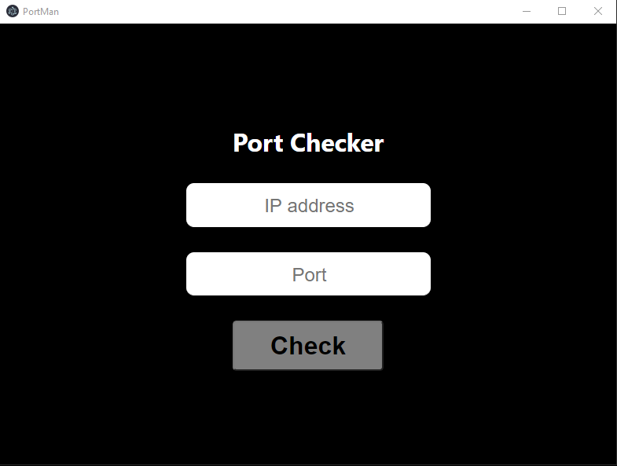

# Port checker application

Simple lightweight application to check if a port is open on a given ip!

## Requirements
Clone the repo, open a terminal in the repo's path and run the following code:
```
npm install
```
Assuming you have [npm](https://www.npmjs.com) installed.

## Usage

Run the following code to test it:

```

npm start

```

## Example
<p align="center">
   
</p>
